### Abstract / Executive Summary

μLearn is a vibrant, peer‑learning community that currently lives on Discord. This blueprint proposes an open protocol and reference architecture that elevates μLearn into a **decentralised, trust‑minimised ecosystem**. Core design levers are W3C DIDs, verifiable credentials, Hyperledger Fabric chain‑code, a fungible **KarmaToken**, and privacy‑preserving zero‑knowledge proofs (ZKPs). The document lays out actors, use cases, protocol SDKs, domain model, stack recommendations, and an incremental migration roadmap.

Key design levers:

* **W3C Decentralised Identifiers (DID v1.0)** for portable self-sovereign identity
* **Verifiable Credentials + DIDComm** (Hyperledger Aries lineage) for reputation portability and selective disclosure
* **Smart-contract-enforced workflows** on Hyperledger Fabric, including a **fungible “KarmaToken”** built with Fabric Token SDK
* **Zero-Knowledge Proofs (ZKPs)** to prove “≥ x karma”, group membership, or eligibility for paid events **without revealing raw scores**
* **Client / provider SDKs + middleware “protocol server”** so existing web, mobile or Discord clients can integrate with minimal re-work, mirroring an adaptor pattern

---

<div class="page-break-before"></div>

## 1  Acronyms & Terms (Glossary)

| Acronym / Term             | Meaning in μLearn context                                                                                                      |
| -------------------------- | ------------------------------------------------------------------------------------------------------------------------------ |
| **DID**                    | Decentralized Identifier – a self‑owned, globally unique identifier controlled by a keypair.                                   |
| **DID Doc / DID Document** | JSON document that a DID resolves to; lists public keys and service endpoints.                                                 |
| **VC**                     | Verifiable Credential – a signed set of claims issued by an authority (e.g., mentor badge).                                    |
| **VP**                     | Verifiable Presentation – a holder‑assembled package of one/more VCs or derived proofs.                                        |
| **ZKP**                    | Zero‑Knowledge Proof – cryptographic proof of a statement without revealing underlying data.                                   |
| **zk‑SNARK**               | A succinct ZKP type used for efficient on‑chain/off‑chain verification.                                                        |
| **BBS+**                   | Signature scheme enabling **selective disclosure** for JSON‑LD VCs.                                                            |
| **AnonCreds**              | Aries/Indy credential format enabling ZK presentations (common in SSI stacks).                                                 |
| **DIDComm v2**             | Encrypted, authenticated messaging protocol for agents/wallets using DIDs.                                                     |
| **VDR**                    | Verifiable Data Registry (e.g., Indy VDR) – ledger/network storing DID/VC metadata.                                            |
| **Aries VC Registry**      | The component (often Indy‑backed) that stores VC schemas, credential definitions, revocation registries, and some public DIDs. |
| **MSP**                    | Membership Service Provider (Fabric) – identity subsystem using X.509 certs for peers/clients.                                 |
| **Chaincode**              | Hyperledger Fabric smart‑contract program that updates ledger state.                                                           |
| **Endorsement Policy**     | Fabric rule defining which peers must endorse (sign) a transaction.                                                            |
| **Fabric Gateway**         | Client API used by apps (middleware) to submit/evaluate Fabric transactions.                                                   |
| **Orderer (Raft)**         | Fabric component ordering transactions into blocks using Raft consensus.                                                       |
| **Token SDK**              | Fabric add‑on enabling fungible tokens (e.g., KarmaToken) with UTXO model.                                                     |
| **UTXO**                   | Unspent Transaction Output – ledger model where balances are sets of spendable outputs.                                        |
| **CID**                    | Content Identifier – content‑addressed hash (e.g., for IPFS artefacts).                                                        |
| **IPFS**                   | InterPlanetary File System – distributed storage; stores artefacts off‑chain; CID on‑chain.                                    |
| **gRPC**                   | High‑performance RPC protocol used between wallet/provider node and middleware.                                                |
| **PWA**                    | Progressive Web App – installable web application form factor for wallet/portal.                                               |
| **SDK**                    | Software Development Kit – μLearn publishes consumer and provider SDKs for integration.                                        |
| **LMS**                    | Learning Management System – university systems integrated via Provider Node.                                                  |
| **HRIS**                   | Human Resources Information System – employer back‑end integrated via Provider Node.                                           |
| **ATS**                    | Applicant Tracking System – recruiting workflow system at providers.                                                           |
| **OIDC**                   | OpenID Connect – used for optional bridge with enterprise SSO into μLearn apps.                                                |
| **PII**                    | Personally Identifiable Information – protected by design via selective disclosure/ZKPs.                                       |
| **HSM**                    | Hardware Security Module – optional secure key custody for institutional roles.                                                |
| **WebAuthn**               | FIDO2 standard for key‑based user authentication; used to unlock wallet operations.                                            |
| **JSON‑LD**                | JSON for Linked Data; used by many VC profiles (e.g., BBS+).                                                                   |
| **BAP**                    | Buyer App (in Beckn terminology)                                                                                               |
| **BPP**                    | Seller App (in Beckn terminology)                                                                                              |
| **BG**                     | Beckn Gateway                                                                                                                  |
| **NR**                     | Network Registry (in Beckn terminology)                                                                                        |
| **TEE**                    | Trusted Execution Environment                                                                                                  |
| **VOPRF**                  | Verifiable Oblivious Pseudorandom Function                                                                                     |
| **PRF**                    | Pseudorandom Function                                                                                                          |
| **PDP**                    | Policy Decision Point                                                                                                          |
| **PEP**                    | Policy Enforcement Point                                                                                                       |

---

<div class="page-break-before"></div>

## 2 System overview

> “*μLearn connects students, mentors, industry and academia through gamified tasks on Discord while a web dashboard tracks progress.*”&#x20; Level‑1 C4 context diagram showing key people, the system under consideration, and external systems.

### Context diagram (C4 Level1)

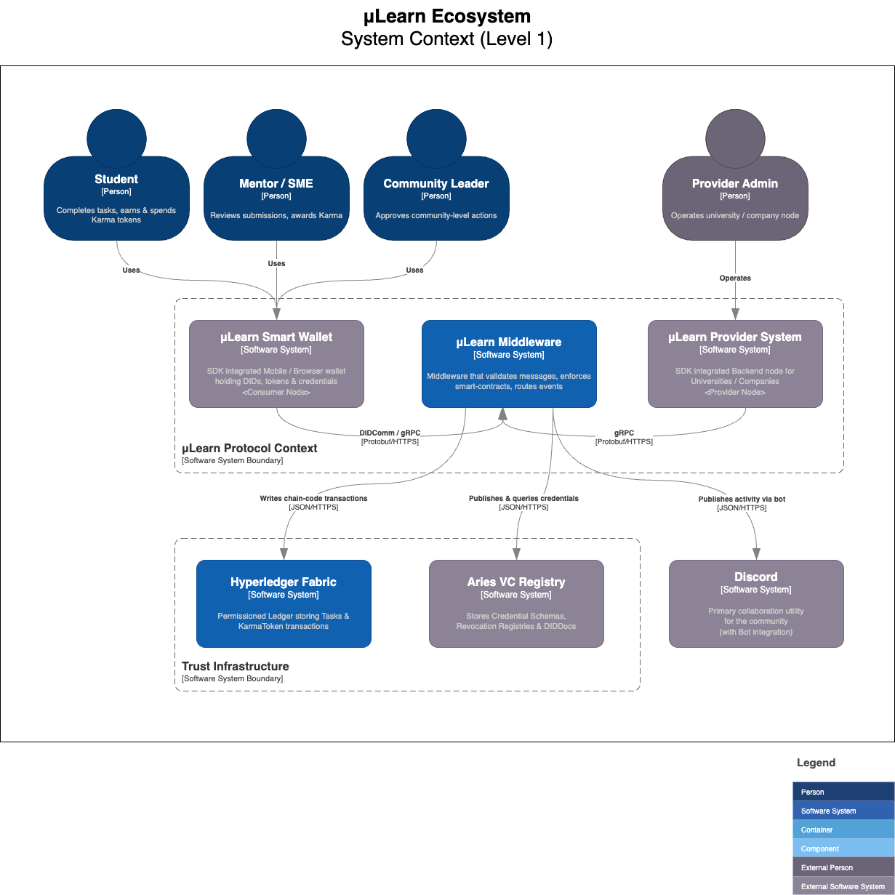

The *Protocol Server* enforces the open message envelope, validates signatures, writes state to Fabric, and bridges legacy channels such as Discord.

### Mapping table

| Blueprint element           | C4 element                              |
| --------------------------- | --------------------------------------- |
| Consumer‑side SDK / wallet  | **wallet**                              |
| Provider‑side SDK / node    | **providerNode**                        |
| Protocol Server             | **protocol** inside **System Boundary** |
| Hyperledger Fabric (ledger) | **fabric**                              |
| Aries VC Registry           | **vcRegistry**                          |
| Discord bot                 | **discord**                             |

### Component Details

| System                    | Definition                                                                                                                  | Purpose in μLearn                                                                                                                                 | Typical usage scenarios                                                                                                              |
| ------------------------- | --------------------------------------------------------------------------------------------------------------------------- | ------------------------------------------------------------------------------------------------------------------------------------------------- | ------------------------------------------------------------------------------------------------------------------------------------ |
| μLearn Middleware (`protocol`)        | Spring Boot service that implements the open μLearn protocol and acts as an API gateway to the ledger & VC Registry. | • Validate & sign/verify all protocol messages.<br>• Invoke Fabric chain‑code.<br>• Persist domain events.<br>• Bridge legacy channels (Discord). | • Task submission & approval flow.<br>• KarmaToken mint/burn.<br>• Governance votes.                                                 |
| μLearn Smart Wallet (`wallet`)        | Mobile/browser wallet + consumer‑side SDK; stores the student’s or mentor’s DID keys, credentials and KarmaToken balances.  | • Self‑sovereign identity & key management.<br>• Generate/selectively disclose ZK proofs.<br>• Sign chain‑code invocations routed via Middleware. | • Student submits task artefact.<br>• Mentor approves & signs badge.<br>• Student redeems tokens for event entry.                    |
| μLearn Provider Node (`providerNode`) | Backend SDK (Java/Kotlin) deployed by universities or companies; exposes provider APIs, subscribes to protocol events.      | • Publish tasks, courses, internships.<br>• Verify ZK proofs / credentials.<br>• Award additional Karma or issue offers.                          | • Company lists internship, consumes ZK proof of skills.<br>• University verifies course‑completion badge before granting credit.    |
| Hyperledger Fabric (`fabric`)         | Permissioned blockchain platform (v3) run by μLearn consortium members.                                                     | • Immutable storage for tasks, KarmaToken transactions, and governance records.<br>• Endorsement policies enforce multi‑party consensus.          | • Mint KarmaToken chain‑code execution.<br>• Record mentor approvals.<br>• Run range‑proof verifying chain‑code.                     |
| Aries VC Registry (`vcRegistry`)      | Ledger‑backed registry for credential schemas, definitions, revocation lists & DIDDocs.                                     | • Makes badges & revocation info globally discoverable.<br>• Supplies public parameters for ZK proof verification.                                | • Wallet fetches schema & revocation bitmap.<br>• Provider verifies badge’s cryptographic proof.<br>• Mentor posts badge revocation. |
| Discord (`discord`)                   | Public chat platform with μLearn bot integration.                                                                           | • Familiar community UI & notifications front‑end.<br>• Quick onboarding for new students.                                                        | • Bot posts “Task #42 approved”.<br>• Leaders trigger giveaways that mint tokens.                                                    |

#### Aries VC Registry

**Aries VC Registry** is a ledger-backed service (or set of smart-contract tables) that comes from the Hyperledger Aries family.  It fulfils three closely-related roles in any self-sovereign-identity (SSI) stack:

| Function                           | What it stores                                                                                                                 | Why it matters                                                                                        |
| ---------------------------------- | ------------------------------------------------------------------------------------------------------------------------------ | ----------------------------------------------------------------------------------------------------- |
| **Credential Schema Registry**     | JSON-LD or AnonCreds schema definitions that define *what fields* appear in a credential and how they are typed.               | All parties must agree on the exact schema hash; otherwise selective-disclosure and ZK proofs break.  |
| **Credential Definition Registry** | Cryptographic public material (issuer keys, revocation support keys) that lets a verifier check signatures or ZK range proofs. | A verifier can fetch the definition and know **which issuer** signed the VC and **how** to verify it. |
| **Revocation Registry**            | Bitmaps or accumulators indicating whether a particular VC has been revoked.                                                   | Learners can prove their badge is *still valid*; providers can instantly reject a revoked VC.         |
| **Public DID Documents**           | DID Docs for issuers and (optionally) students, including service endpoints and public keys.                                   | Wallets resolve DIDDocs to build secure DIDComm channels.                                             |

In most Aries deployments these artefacts live on a **purpose-built Indy (VDR) network** or as state in Hyperledger Fabric chain-code, but the term “VC Registry” is used generically to cover whichever storage layer the project chooses.

---

### Why μLearn needs a VC Registry

1. **Standardised micro-badges**
   *Mentors* issue “Micro-Badge” verifiable credentials—e.g., *“Completed React Task #42 with score ≥ 80 %”*.

   * **Issuer** writes the badge schema & credential definition to **vcRegistry** once.
   * All verifier nodes (provider companies, universities) fetch the same schema hash → deterministic verification.

2. **Selective-disclosure & ZKP proof generation**
   Students use the **Smart Wallet** to generate ZK proofs—“I hold ≥ 1 badge in category *Blockchain*” or “My *KarmaToken balance ≥ 1000*”.

   * Wallet queries **vcRegistry** for the revocation status & public parameters needed to build the proof.
   * The proof is sent to the **Provider Node**; the node verifies against the same registry entry.

3. **Revocation after misconduct**
   If the community revokes a badge (e.g., plagiarism detected), the mentor posts a revocation delta to **vcRegistry**. Subsequent proofs against that badge will fail.

4. **Portability outside μLearn**
   Because μLearn publishes schemas/definitions in a universally accessible registry, a participating university can verify badges **even if it never connects to μLearn middleware**, as long as it can reach the registry or a cached copy.

---

### Sequence example: *Student applies for an internship*

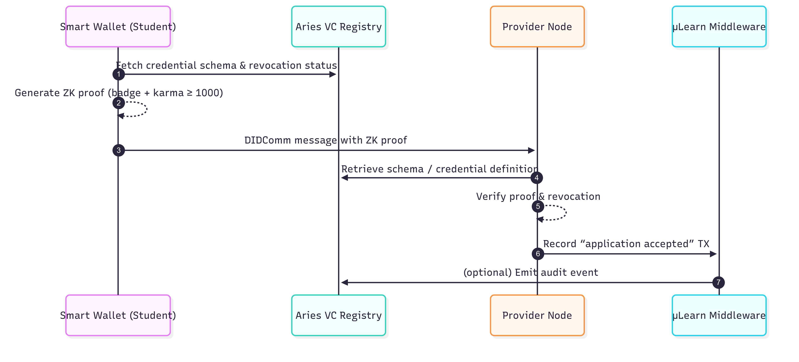

**Key points**

* The registry is *read-heavy* for wallets and verifier nodes, *write-light* for issuing mentors or governance chain-code.
* It is authoritative for revocation and public verification keys; removing it would force μLearn to bake the same data directly into every credential—making upgrades and revocations nearly impossible.

---

### Relationship to Hyperledger Fabric in the diagram

* **Hyperledger Fabric** tracks *state* and *tokens* (tasks, KarmaToken mints, governance votes).
* **Aries VC Registry** tracks *identity & credential metadata*.

They are separate subsystems but together form the **Trust Infrastructure** layer.  Fabric tells us *“who owns what and which task was approved”*; the VC Registry lets anyone verify *“who you are and whether your credential is still valid”*—all without leaking private data.

---

#### μLearn Middleware (Protocol)

*Definition* — A Spring Boot 3 micro‑service that implements the open μLearn Protocol. It validates every inbound message (DIDComm, gRPC, REST), enforces chain‑code via Hyperledger Fabric Gateway, maintains an append‑only domain‑event store, and bridges legacy channels such as Discord.

---

**Why μLearn needs Middleware**

1. **Trust Gateway** – Ensures all messages are signed by valid DIDs & conform to JSON schema before hitting the ledger.
2. **Business Policy Engine** – Encodes endorsement policies: *“At least one Mentor + one Leader must approve before KarmaToken mint.”*
3. **Legacy Bridge** – Allows Discord bots and existing web dashboards to remain unchanged while the back‑end moves to decentralised trust.
4. **Observability Hub** – Single point for Prometheus metrics and audit logs required by governance consortium.

---

**Sequence example – Student submits a task**

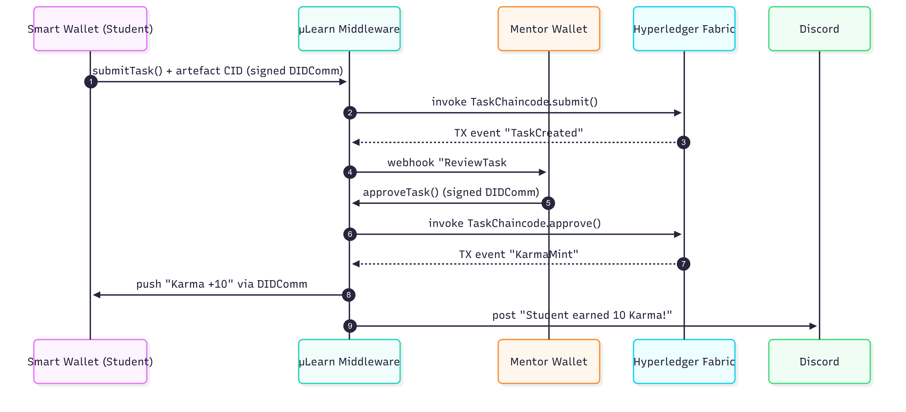

---

#### μLearn Smart Wallet (Consumer Node)

*Definition* — A cross‑platform wallet (React‑Native mobile + browser extension) that acts as the *consumer‑side SDK*. It stores DID keys (Ed25519), AnonCreds & BBS+ credentials, and **KarmaToken** UTXOs. It also packs/unpacks DIDComm v2 envelopes and exposes gRPC stubs like `submitTask()`, `redeemToken()`, `proveBadge()`.

---

<div class="page-break-before"></div>

**Why μLearn needs the Smart Wallet**

1. **Self‑Sovereign Identity** – Students control their private keys and data without relying on μLearn servers.
2. **Privacy‑Preserving Proofs** – Generates ZK‑SNARKs to prove badge ownership or token balance thresholds.
3. **Token Store & Signing Device** – Holds UTXOs and signs Fabric transactions via Gateway API.
4. **Omnichannel UX** – Same wallet works in mobile app, PWA, or as browser plug‑in for third‑party learning portals.

---

**Sequence example – Student redeems tokens for event entry**


---

#### μLearn Provider Node

*Definition* — A JVM‑based SDK (Spring Boot starter) deployed inside a University or Company back‑end. It subscribes to protocol events, publishes tasks/opportunities, and verifies credentials or ZK proofs from students.

---

**Why μLearn needs Provider Nodes**

1. **Autonomous Integration** – Lets each provider integrate μLearn with LMS, HRIS, or ATS without exposing private infra.
2. **Verifiable Hiring / Credit Workflow** – Nodes verify skills via ZK proofs before issuing offers or course credits.
3. **Decentralised Governance** – Providers can run Fabric peers & join endorsement policies for true multi‑party control.

---

**Sequence example – Company publishes internship & accepts applicant**

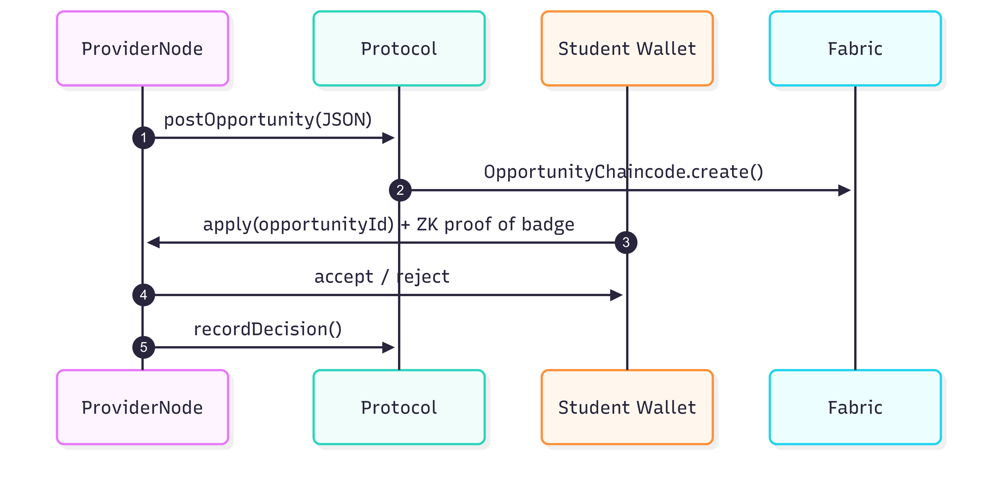

---

#### Hyperledger Fabric

*Definition* — A permissioned blockchain framework (v3) with MSP‑based identity, Raft ordering, and the Token SDK. μLearn deploys three chain‑code modules: `TaskChaincode`, `KarmaToken`, and `Governance`.

---

**Why μLearn needs Fabric**

1. **Immutability & Auditability** – Provides tamper‑evident logs of task approvals and token economics.
2. **Fine‑Grained Endorsement** – Peers operated by Mentors, Leaders, and Providers jointly validate transactions.
3. **Token SDK** – Enables ERC‑20‑like KarmaToken with on‑chain balance checks that smart contracts can query.
4. **Pluggable Privacy** – Supports Fabric‑Private‑Chaincode for confidential ZK proof verification if needed.

---
<div class="page-break-before"></div>

**Sequence example – KarmaToken mint**

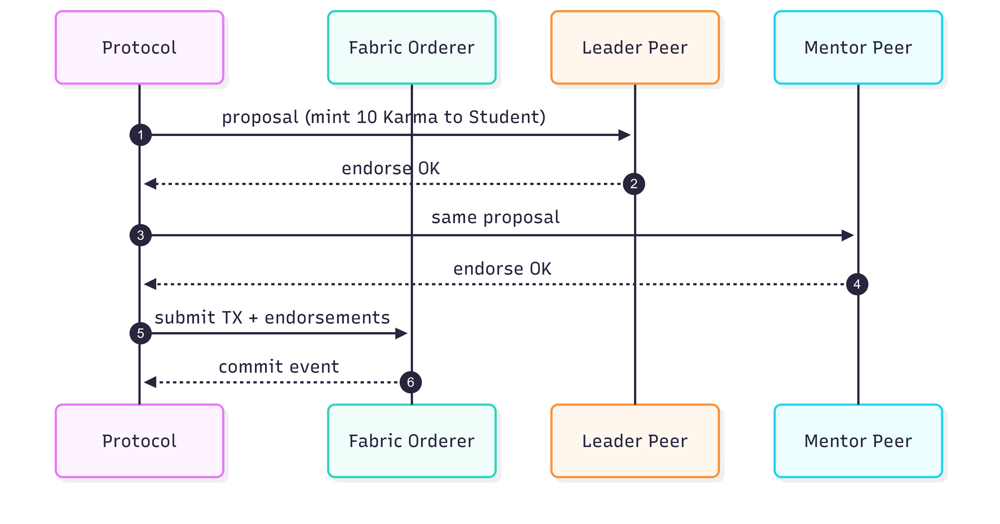

---

#### Discord Integration

*Definition* — A set of Discord bots plus web‑hooks that mirror on‑chain events into the community’s primary chat platform and capture quick‑reaction inputs back to Middleware.

---

**Why μLearn keeps Discord**

1. **Zero‑Friction Onboarding** – Most students already use Discord daily.
2. **Community Engagement** – Real‑time leaderboards, streaks, and shout‑outs keep momentum high.
3. **Backwards Compatibility** – Existing task‑submission bot commands can call the Middleware API under the hood.

---

**Sequence example – Bot announces task approval**

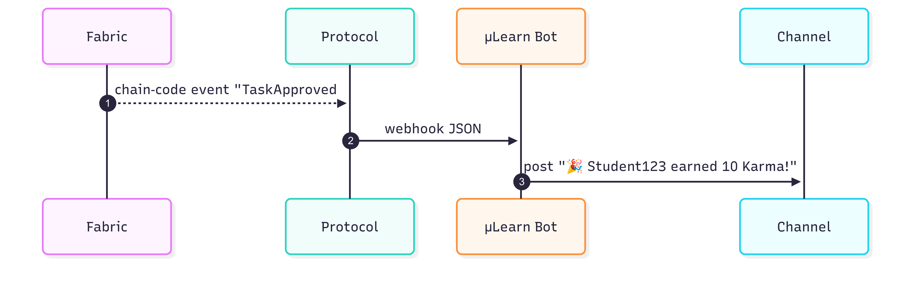

---
<div class="page-break-before"></div>

## 3 Actors, roles & entitlements

| Actor                                  | DID method              | Fine‑grained permissions                             |
| -------------------------------------- | ----------------------- | ---------------------------------------------------- |
| **Student**                            | `did:key` / `did:web`   | Submit tasks; redeem tokens; present ZK proofs       |
| **Mentor / SME**                       | `did:μlearn:mentor`     | Moderate tasks; approve Karma; issue micro‑badge VCs |
| **Community Leader**                   | `did:μlearn:lead`       | Community governance vote; bulk awards               |
| **University / Company Provider Node** | `did:indy` / `did:corp` | Publish opportunities; verify proofs                 |
| **Protocol Server**                    | `did:μlearn:hub`        | Message routing; chain‑code invocation               |
| **Ledger Ordering Service**            | Consortium MSP IDs      | Consensus on KarmaToken & task txns                  |
| **Aries VC Registry**                  | —                       | Store & resolve credential schemas                   |


---

<div class="page-break-before"></div>

## 4 Decentralized Identifiers (DID) in the μLearn Architecture

### What a DID is (and why it matters)

A **Decentralized Identifier (DID)** is a globally unique identifier controlled by its subject (not by a central provider). A DID resolves to a **DID Document** (JSON) that lists public keys and service endpoints. In μLearn, DIDs provide portable, cryptographic identity for **students, mentors/leaders, provider nodes, and the middleware**, enabling secure messaging (DIDComm), verifiable credentials (VCs), and privacy‑preserving proofs without tying identity to any single backend.

**Why DIDs are central here**

* **Trust without lock‑in:** Any party can verify who signed what using the DID Document and standard verification suites — no μLearn server call is required.
* **Interoperability:** Based on W3C DID & VC specs; credentials verify in or outside μLearn.
* **Privacy by design:** Use **pairwise/rotating DIDs** to prevent cross‑provider correlation.
* **Composable authorization:** Combine *who you are* (DID Auth) + *what you can prove* (VCs/ZKPs) + *on‑chain state* (Karma balance) under policy.

---

### Recommended DID methods by role

| Role / System                    | DID method                                               | Rationale                                                        |
| -------------------------------- | -------------------------------------------------------- | ---------------------------------------------------------------- |
| **Student**                      | `did:key` for quick start; `did:peer` for pairwise links | No registration overhead; pairwise prevents correlatability.     |
| **Mentor / Leader**              | `did:key` or `did:web`                                   | Public presence acceptable; `did:web` ties identity to org site. |
| **Provider Node (Univ/Company)** | `did:web` or `did:indy`                                  | Public, auditable identity; aligns with Aries/Indy where used.   |
| **μLearn Middleware**            | `did:web:mulearn.org`                                    | Stable public system identity clients can pin to.                |
| **Issuers/Verifiers of VCs**     | `did:web` / `did:indy`                                   | Keys discoverable for verification and revocation flows.         |

> A future `did:mulearn` method can be added if governance requires a dedicated method; start with the broadly supported ones above. if governance requires a dedicated method; start with the broadly supported ones above.

---

### Creation, publication, rotation

**Creation (wallet/node):**

1. Generate key pair (Ed25519 recommended). 2) Form DID:

* `did:key` derived from the public key (no registry).
* `did:peer` created pairwise on first contact (wallet ↔ provider node).
* `did:web` hosted file at `https://<domain>/.well-known/did.json`.
* `did:indy` written to an Indy/VDR ledger via Aries agents.

**Publication / Resolution:**

* `did:web`: publish **did.json** on the org domain; resolve over HTTPS.
* `did:indy`: public DIDs, credential schemas/defs, revocation registries live in the **Aries VC Registry**.
* `did:key` / `did:peer`: resolve deterministically or via exchanged DIDDocs.

**Rotation & recovery:**

* Update DID Document with a new `verificationMethod` and deprecate old keys.
* For `did:web`, push updated did.json; for `did:indy`, write a new NYM/ATTRIB as per network rules.
* Wallets store a recovery seed; optional encrypted backups; institutions may use HSMs for custodial roles.

---

### How DIDs are used in μLearn

#### 1) DID Auth & message signing

* Wallets (students/mentors) sign DIDComm/gRPC payloads with their DID keys.
* Middleware resolves the DID Document and verifies signatures, then applies policy (e.g., *mentor can approve task*).

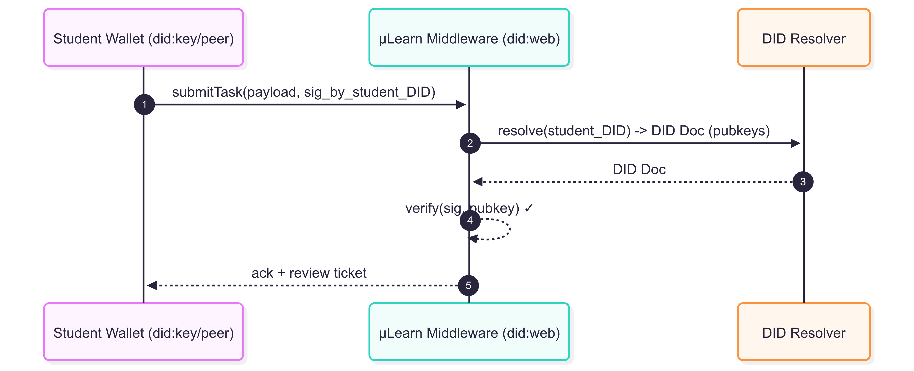

#### 2) Credentials & selective disclosure

* Mentor (Issuer DID) issues a **VC** (e.g., *Completed React Task 42 ≥80%*).
* Wallet later presents a **ZK proof** (BBS+/AnonCreds) to a Provider Node: *“I hold a Frontend badge”* without exposing identity/score.

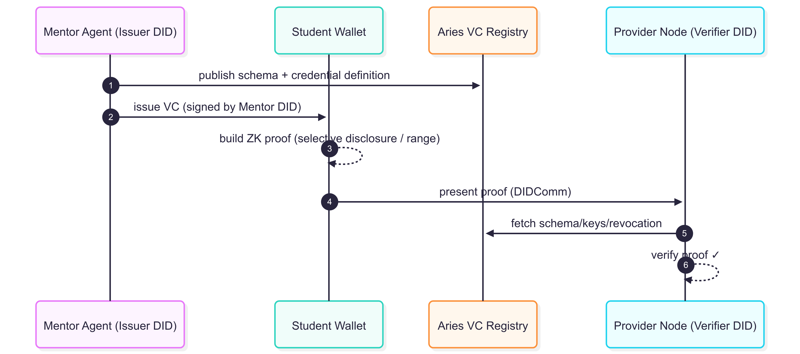

#### 3) Binding DIDs to Fabric/MSP identities

Fabric uses X.509 **MSP** certs for tx identities. We link them to DIDs via a **Verifiable Credential** issued by μLearn Governance:

* Claim example: `{ fabric_msp_subject: "<cert fingerprint>", did: "<did:web:provider.com>", role: "Provider" }`
* Chain‑code checks both the MSP subject **and** a verifiable presentation proving control of the corresponding DID/role before minting tokens or approving tasks.

---

### W3C dependencies & stack alignment

* **W3C DID Core**: DID syntax, DID Documents, verification relationships.
* **W3C VC Data Model**: Verifiable Credentials/Presentations used for claims and selective disclosure.
* **DID Resolution**: How resolvers fetch DID Docs (`did:web`, `did:key`, `did:peer`, `did:indy`).

**Where DIDs are consumed in the stack**

| Layer             | What μLearn uses                 | How DIDs are used                                         |
| ----------------- | -------------------------------- | --------------------------------------------------------- |
| **Wallet**        | React‑Native + Aries Bifold fork | Key mgmt, DIDComm, build VCs/VPs, ZK proofs               |
| **Provider Node** | Spring Boot SDK + Aries libs     | Issuer/Verifier roles; DID resolution; proof verification |
| **Middleware**    | Spring Boot + Fabric Gateway     | DID Auth on requests; policy gating; DID ↔ MSP binding    |
| **VC Registry**   | Aries/Indy VDR                   | Stores schemas, cred defs, revocation, public DIDs        |
| **Fabric (v3)**   | Task/Karma/Governance chain‑code | Policies reference DIDs via VC binding                    |

---

### Practical defaults & ops

* Prefer `did:peer` for wallet↔provider pairwise identifiers; rotate regularly.
* Enforce WebAuthn unlock on wallets; keep multiple device sub‑keys **inside** one wallet (not multiple wallets).
* Check revocation status on every proof; time‑bound keys/VCs; publish rotation playbooks.
* Maintain an allowlist of issuer/verifier DIDs for mentors, leaders, and providers; changes approved on‑chain.

---

### Summing up

DIDs are the **spine of μLearn’s trust fabric**: user‑controlled identifiers created in wallets/nodes, optionally published, and used to sign messages, receive credentials, and generate privacy‑preserving proofs. By aligning with **W3C DID/VC** and Aries/Indy + Fabric, identities and credentials remain **portable, private, and verifiable**—inside and outside μLearn.

---

###  DID Methods – Reference & Guidance

| DID Method | Anchor / Resolution                                                     | Strengths                                                                        | Trade‑offs                                                         | Recommended μLearn Usage                                                          |
| ---------- | ----------------------------------------------------------------------- | -------------------------------------------------------------------------------- | ------------------------------------------------------------------ | --------------------------------------------------------------------------------- |
| `did:key`  | Self‑certifying from the public key; no external registry.              | Instant, offline, privacy‑friendly; great for ephemeral/pairwise use.            | Not publicly discoverable; rotation requires distributing new DID. | **Students** for quick start and wallet↔middleware calls; short‑lived identities. |
| `did:peer` | Pairwise DIDs exchanged directly between parties; resolve locally.      | Best privacy; no global trace; easy rotation; perfect for one‑to‑one links.      | Not suitable for public discovery or cross‑party reuse.            | **Student ↔ Provider Node** relationships; rotate per relationship.               |
| `did:web`  | Hosted at `https://<domain>/.well-known/did.json`; resolved over HTTPS. | Human‑auditable, easy ops; ties DID to DNS and web PKI; great for public actors. | Requires domain control and web hosting; trust rooted in HTTPS.    | **Providers**, **μLearn Middleware**, mentors/leaders with public roles.          |
| `did:indy` | Written to an Indy VDR (Aries networks); discovery via ledger.             | Native to Aries/AnonCreds; supports revocation registries & schemas.             | Requires participation in an Indy network; governance overhead.    | **Aries VC Registry**, issuers/verifiers in SSI domains that already run Indy.    |

**Notes & patterns**

* Prefer **pairwise first**: use `did:peer` for privacy‑sensitive interactions; fall back to `did:key` for quick sessions.
* Use **public methods** (`did:web` or `did:indy`) when third parties must **discover** and **verify** you without a prior relationship (e.g., provider recruitment pages, governance issuers).
* A custom `did:mulearn` method can be introduced later if the consortium wants a dedicated method with specific resolution rules; not needed for phase‑1.

---

<div class="page-break-before"></div>

## 5 Use-case catalogue & UML

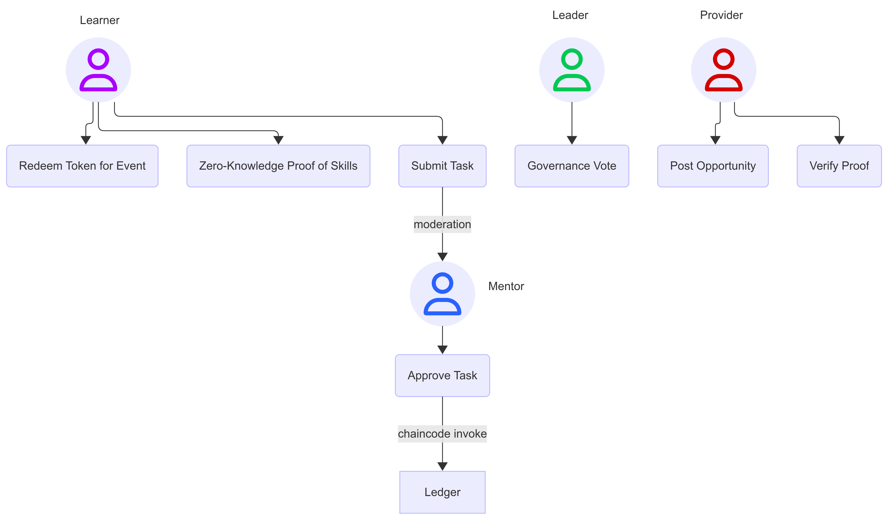

**Representative scenarios**

| #     | Scenario                         | Primary flow (happy path)                                                                                                                                 |
| ----- | -------------------------------- | --------------------------------------------------------------------------------------------------------------------------------------------------------- |
| UC-01 | *Task submission*                | Learner signs DID Auth → uploads artefact → Protocol Server stores IPFS hash off-chain → invokes `TaskChaincode.submit()` → emits event for Mentor review |
| UC-02 | *Karma award*                    | Mentor signs approval → chaincode mints `KarmaToken` to learner wallet; wallet emits push‐notification                                                    |
| UC-03 | *Event access ZKP*               | Wallet generates zk-SNARK showing balance ≥ 1000 tokens without revealing exact amount; verifier smart-contract returns “true” → gate opens               |
| UC-04 | *Provider posting & fulfil-ment* | Company Node publishes internship → learners apply → ZKP proof of skills verified → provider issues VC offer letter                                       |

---

<div class="page-break-before"></div>

## 6 High-level design & protocol

### 6.1 Decentralised IDs

* Self-sovereign DID documents resolve to μLearn-hosted DID method or popular methods (`did:key`, `did:web`) for maximum wallet compatibility, using W3C DID v1.0 spec.

### 6.2 Smart-contract consensus

* **Hyperledger Fabric** selected for ● permissioned governance ● pluggable consensus ● mature MSP/PKI model.
* Chaincode (Java) modules: `TaskChaincode`, `KarmaToken`, `Governance`.
* Endorsement: ≥ N/3 community-lead peers + 1 ProtocolServer peer.

### 6.3 KarmaToken economics

* ERC-20–like fungible token via **Fabric Token SDK**; soft-cap supply tied to accumulated karma. Tokens burn when redeemed for paid events or merchandise.

### 6.4 Smart wallet

* React-Native / Flutter mobile wallet + browser extension. Stores:

  * Fabric signing key (ECDSA-P256)
  * Aries/AnonCreds credentials
  * Off-ledger IPFS pointers to portfolios

### 6.5 Protocol SDK layout

| Layer          | Consumer SDK                             | Provider SDK                 | Middleware (Protocol Server) |
| -------------- | ---------------------------------------- | ---------------------------- | ---------------------------- |
| **Messaging**  | DIDComm v2                               | DIDComm v2                   | DIDComm routing, WebSockets  |
| **AuthN**      | DID Auth + WebAuthn                      | MTLS + DID                   | OIDC-bridge                  |
| **Domain API** | `learn.submitTask()`, `wallet.balance()` | `provider.postOpportunity()` | Validation, schema mapping   |
| **Transport**  | gRPC                                     | gRPC                         | TLS 1.3, HTTP/2              |

### 6.6 Zero-Knowledge Proof recommendations

| Requirement                            | Technique                   | Lib / project                                    |
| -------------------------------------- | --------------------------- | ------------------------------------------------ |
| Proof of karma ≥ threshold             | Range proofs (Bulletproofs) | `hyperledger/fabric-private-chaincode` + `gnark` |
| Anonymous membership in Interest Group | Set-membership zk-SNARK     | `AnonCreds` / `ursa`                             |
| Selective disclosure of profile fields | BBS+ signatures             | Aries Bifold                                     |

Academic and industry work show ZKP integration with Fabric for healthcare privacy and generic identity use-cases.

<div class="page-break-before"></div>

### 6.7 Domain model (simplified ER-style)


**Why these cardinalities?**

* A **Provider** publishes many tasks; a task belongs to exactly one provider.
* A **Student** may create many submissions; each submission is for exactly one task.
* A **Student** may have at most one active application per opportunity; a provider can receive many applications.
* Each student owns one self‑sovereign wallet holding credentials and tokens.

#### FAQ

1. **Why is **\`\`** one‑to‑one?**  Because one submission represents a single student’s attempt at one specific task. Chain‑code uses this to enforce idempotency and audit.
2. **Why is **\`\`** one‑to‑one?**  The ecosystem mandates one self‑sovereign wallet per DID. Multiple device keys can live inside the wallet object.


### 6.8 Stack recommendation (prod-ready)

| Layer               | Choice                                  | Rationale                                                                             |
| ------------------- | --------------------------------------- | ------------------------------------------------------------------------------------- |
| Ledger              | **Hyperledger Fabric v3 + Token SDK**   | Permissioned, mature ops, Java chaincode                                              |
| Identity / VC       | **Aries “post-2025 fork”** + Indy VDR   | DIDComm, AnonCreds, ZKP ready |
| Smart contracts     | Java (fabric-contract-java v2)          | Alignment with existing μLearn Java skillset                                          |
| Middleware          | Spring Boot 3 + gRPC                    | Reactive IO, native Fabric Gateway                                                    |
| Wallet              | React-Native + Aries Bifold fork        | Mobile-first, cross-platform                                                          |
| Storage (off-chain) | IPFS Cluster                            | Cheap, tamper-evident artefact storage                                                |
| Observability       | Prometheus / Grafana; Jaeger tracing    |                                                                                       |
| CI / CD             | GitHub Actions → Kubernetes (GKE / AKS) | Blue-green deployments of peers & apps                                                |

#### On-ledger vs off-ledger

| Data element                             | Justification                        | Storage                              |
| ---------------------------------------- | ------------------------------------ | ------------------------------------ |
| KarmaToken balance, task approval hashes | Require immutability & audit         | **On-ledger**                        |
| Task artefacts (images, code, PDFs)      | Large & binary                       | IPFS, hash on-chain                  |
| Discord message IDs, chat logs           | PII & noisy                          | Off-ledger DB (PostgreSQL)           |
| DID Documents                            | Public keys – need global resolution | DID Method-specific (ledger or HTTP) |

---
<div class="page-break-before"></div>

## 7 Conclusion & next steps

This blueprint demonstrates that μLearn can evolve into a standards-driven, interoperable learning network while **preserving its community DNA**.
Immediate pilots:

1. **Fabric test-network** with *TaskChaincode* + *KarmaToken*; hook existing Discord bot to invoke chaincode.
2. **Wallet MVP** issuing learner DIDs and holding demo tokens.
3. **ZKP range-proof PoC** for “karma ≥ 1000” gate at an invite-only hackathon.
4. Draft **μLearn DID Method** & register on W3C DID Spec Registries.
5. Form a **governance consortium** (GTech, universities, hiring partners) — leverage a network-governance playbook.

By staging these steps, μLearn can incrementally migrate critical trust functions to the decentralised layer without disrupting day-to-day learner experience.

---

<div class="page-break-before"></div>

## Annex A — Beckn Alignment & Network Interop (Buyer/Seller/Gateway/Registry)

This section maps μLearn components and flows onto Beckn terminology so integrators from Beckn networks can onboard quickly.

### A.1 Component Mapping

| Beckn concept             | Beckn role                  | μLearn counterpart                                                  | Notes                                                                                |
| ------------------------- | --------------------------- | ------------------------------------------------------------------- | ------------------------------------------------------------------------------------ |
| **Buyer App (BAP)**       | Consumer-facing             | **Consumer Node / μLearn Smart Wallet** (Student/Mentor UI + SDK)   | Signs requests with DID; composes VPs/ZKPs.                                          |
| **Seller App (BPP)**      | Provider backend            | **μLearn Provider Node** (University/Company SDK)                   | Publishes Tasks/Opportunities/Events; verifies proofs; issues VCs.                   |
| **Beckn Gateway (BG)**    | Discovery/routing           | **μLearn Middleware (Protocol Server)**                             | Validates envelopes; routes to providers; enforces policy; writes anchors to Fabric. |
| **Network Registry (NR)** | Participant registry & keys | **Aries VC Registry + DID methods (**`did:web`**, **`did:indy`**)** | Keys, schemas, revocation; replaces NR PKI with W3C DID/VC stack.                    |
| **Settlement**            | Payments                    | **KarmaToken on Hyperledger Fabric**                                | Token mint/burn replaces fiat settlement for many flows.                             |

### A.2 Message Mapping (high level)

| Beckn API                 | μLearn analogue                     | Payload highlights                                        |
| ------------------------- | ----------------------------------- | --------------------------------------------------------- |
| `/search` → `on_search`   | Discover Tasks/Opportunities/Events | Filters (skill/category, karma threshold) ↔ catalog items |
| `/select` → `on_select`   | Choose item                         | Requirements (ZKP needed, rubric, token price)            |
| `/init` → `on_init`       | Prepare transaction                 | DID challenge, draft submission/ticket                    |
| `/confirm` → `on_confirm` | Finalise                            | Submission hash + VP (ZK); token mint/burn ack            |
| `/status` → `on_status`   | Track                               | Moderation state, application state, ticket state         |
| `/rating` → `on_rating`   | Feedback                            | Mentor rubric; optional Badge VC issuance                 |

### A.3 Sequence — Task discovery & approval (Beckn-style)

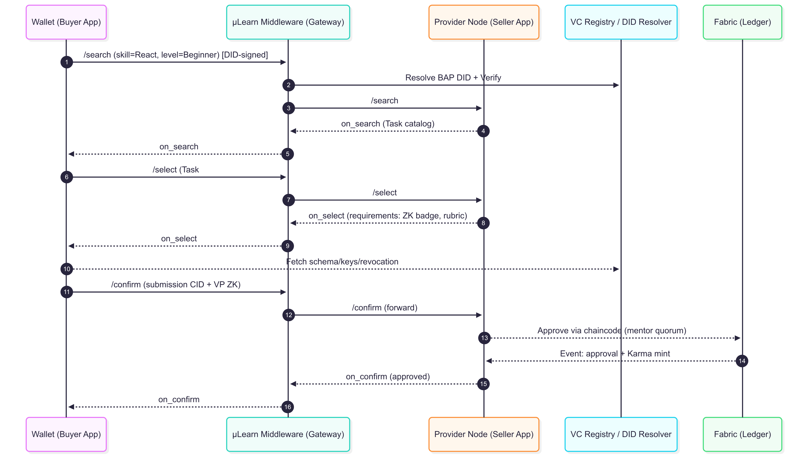 

### A.4 Sequence — Event redemption (Karma)

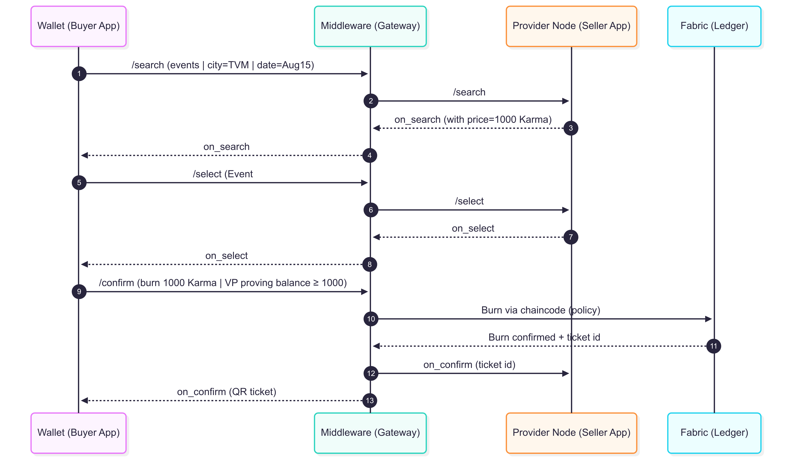 

---

<div class="page-break-before"></div>

## Annex B — Reverse Discovery & Blinded Proof Catalog (No TEE)

This annex replaces “broadcast to wallets” with a **pull + prefilter** design that scales and preserves privacy.

### B.1 Overview

* **Goal:** Let Providers discover qualified candidates **without** learning raw skills/PII or waking all devices.
* **Approach:** Wallets publish an **epochal, anonymous catalog row** of **blinded tokens and commitments** derived from their credentials; Middleware indexes these; Providers query by predicates; wallets that match and **consent** return fresh ZK proofs.

### B.2 Publish phase (daily/epoch)

1. **Wallet → Middleware (VOPRF round):** For each tag (e.g., `react`), wallet sends a **blinded** value. Middleware applies its secret PRF key and returns a **blinded evaluation** + proof.
2. **Wallet (local):** Unblinds to get the stable **token** `T = PRFₖ(tag)`.
3. **Wallet → Middleware:** Posts/updates its **catalog row** containing only tokens/commitments (no PII) + a derived proof that they originate from trusted μLearn VCs.

> **Note:** Middleware never unblinds the wallet’s inputs. The wallet blinds and **unblinds**; the server only evaluates with its secret key.

### B.3 Catalog row (suggested schema)

```json
{
  "handle": "anon:inbox:9f...a2",             
  "epoch": "2025-08-08",
  "tagTokens": ["oprf:AA9...", "oprf:Q2k..."],
  "badgeRoot": "merkle:zsha256:...",           
  "karma": {
    "commit": "pedersen:...C...",
    "coarse": { "ge100": true, "ge500": true, "ge1000": true, "ge2000": false }
  },
  "attestation": {
    "type": "DerivedProof",
    "issuers": ["did:web:mulearn.org", "did:web:partner.edu"],
    "schemas": [
      "https://mulearn.org/schemas/badge/v1",
      "https://mulearn.org/schemas/account-binding/1"
    ],
    "proof": "bbs+:... or anoncreds:..."
  },
  "revocation": {
    "statusRefs": ["https://.../statuslists/2025/badges#1234"],
    "expires": "2025-08-09T00:00:00Z"
  }
}
```

### B.4 Search & contact

1. **Provider → Middleware:** `searchCandidates{ tags=[react,git], karma≥1000 }`
2. **Middleware:** Compute `PRFₖ(tag)` for each tag; filter rows by `tagTokens` and coarse range flags.
3. **Middleware → Wallets (by handle):** Invite only matches to respond.
4. **Wallets (consenting):** Return **fresh VP** with exact ZK proofs + pairwise DID or continue blinded contact.

### B.5 Availability & privacy

* **Mediator inbox (pull):** Wallets poll/long-poll queries; no mass push.
* **k-anonymity:** Release results only if ≥ *k* matches.
* **Key rotation:** Rotate PRF key per epoch; wallets republish.
* **No raw attributes on server:** Only tokens/commitments and verifiable attestations.

---

<div class="page-break-before"></div>

## Annex C — Identity, Auth & Crypto Details

### C.1 Verification pipeline (DID Auth)

1. Resolve DID → get public key (method-specific).
2. Verify signature over canonical payload (Ed25519 or ES256).
3. Freshness: `nonce/iat/jti` checks.
4. **Account binding**: map DID → μLearn account/roles.
5. (If Fabric update) Require VP linking DID ↔ MSP/X.509 identity.

### C.2 Ed25519 vs ECDSA (layman summary)

* **Ed25519:** modern, fast, deterministic; great for wallets and `did:key`.
* **ECDSA P‑256 (ES256):** web/enterprise standard; great for `did:web`, TLS/PKI alignment.

### C.3 Verification essentials (engineer notes)

* **Ed25519:** check canonical encodings; compute `h = SHA‑512(R || A || msg) mod L`; check `[S]B = R + [h]A`.
* **ECDSA P‑256:** parse `(r,s)`; check ranges and **low‑S**; `e=SHA‑256(msg)`; verify `x(X) mod n == r`.
* Guard against replay, bad points, encoding confusion (DER vs raw 64B for ES256).

---

<div class="page-break-before"></div>

## Annex D — VC Storage, Policy & Issuance Roles

### D.1 Where to store VCs

* **Do not** store full VCs on-chain (privacy, selective disclosure, erasure).
* Store on-ledger: **issuer allowlists**, **policy**, **revocation/status**, and optional **hash anchors** (salted or Merkle roots) for timestamping.

### D.2 Facts vs Rules

* **VCs carry facts** (who/what/when).
* **Smart contracts carry rules** (who is trusted, what claims are required) and enforce them under endorsement policy.

### D.3 Issuer roles (who signs)

| Credential                       | Issuer DID                                | Trigger                                    |
| -------------------------------- | ----------------------------------------- | ------------------------------------------ |
| Account‑Binding VC               | μLearn Governance (`did:web:mulearn.org`) | Enrollment ceremony success                |
| Task‑Completion / Micro‑Badge VC | **Provider Node / Mentor org**            | Chaincode emits `SubmissionApproved` event |
| Offer/Internship VC              | **Provider Node**                         | Selection confirmed                        |
| Event Ticket VC (optional)       | Event organizer                           | Token burn confirmed                       |

> Chaincode **triggers** issuance (events, anchors) but **never holds issuer private keys**.

### D.4 Issuance flow (sequence)

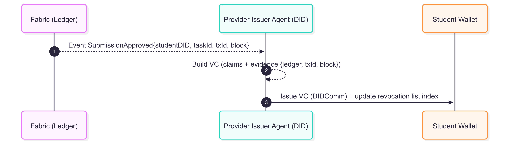 

### D.5 Policy on-chain (PDP/PEP)

* Maintain **policy JSON/DSL** on Fabric: required schemas, issuer allowlists, ZKP requirements, ledger predicates.
* Evaluate either **inside chaincode** or via **multi‑org verifier attestations** required by endorsement policy.

---

<div class="page-break-before"></div>

## Annex E — OPRF/VOPRF (Plain English) & Errata

* **PRF** is a **keyed** function `F_k(x)` that lets the key‑holder compute consistent tokens; not just a forward hash.
* **OPRF:** server applies `F_k` to a **blinded** input it can’t read; wallet unblinds to get `F_k(tag)`.
* **VOPRF:** adds a proof the server used the correct key.
* **Errata (clarification):** In the publish phase, the **wallet** blinds and **unblinds**; the middleware only evaluates with its secret key and **never learns raw tags**.

---

*End of annexes.*