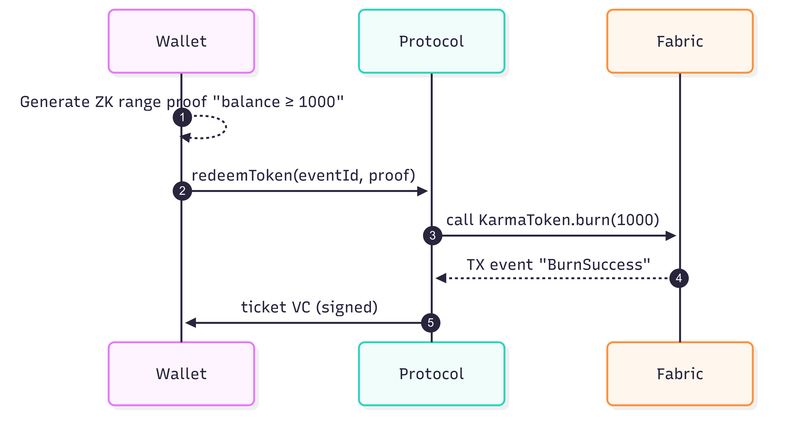

### Abstract / Executive Summary

μLearn is a vibrant, peer‑learning community that currently lives on Discord. This blueprint proposes an open protocol and reference architecture that elevates μLearn into a **decentralised, trust‑minimised ecosystem**. Core design levers are W3C DIDs, verifiable credentials, Hyperledger Fabric chain‑code, a fungible **KarmaToken**, and privacy‑preserving zero‑knowledge proofs (ZKPs). The document lays out actors, use cases, protocol SDKs, domain model, stack recommendations, and an incremental migration roadmap.

Key design levers:

* **W3C Decentralised Identifiers (DID v1.0)** for portable self-sovereign identity
* **Verifiable Credentials + DIDComm** (Hyperledger Aries lineage) for reputation portability and selective disclosure
* **Smart-contract-enforced workflows** on Hyperledger Fabric, including a **fungible “KarmaToken”** built with Fabric Token SDK
* **Zero-Knowledge Proofs (ZKPs)** to prove “≥ x karma”, group membership, or eligibility for paid events **without revealing raw scores**
* **Client / provider SDKs + middleware “protocol server”** so existing web, mobile or Discord clients can integrate with minimal re-work, mirroring an adaptor pattern

## 1  Acronyms & Terms (Glossary)

| Acronym / Term             | Meaning in μLearn context                                                                                                      |
| -------------------------- | ------------------------------------------------------------------------------------------------------------------------------ |
| **DID**                    | Decentralized Identifier – a self‑owned, globally unique identifier controlled by a keypair.                                   |
| **DID Doc / DID Document** | JSON document that a DID resolves to; lists public keys and service endpoints.                                                 |
| **VC**                     | Verifiable Credential – a signed set of claims issued by an authority (e.g., mentor badge).                                    |
| **VP**                     | Verifiable Presentation – a holder‑assembled package of one/more VCs or derived proofs.                                        |
| **ZKP**                    | Zero‑Knowledge Proof – cryptographic proof of a statement without revealing underlying data.                                   |
| **zk‑SNARK**               | A succinct ZKP type used for efficient on‑chain/off‑chain verification.                                                        |
| **BBS+**                   | Signature scheme enabling **selective disclosure** for JSON‑LD VCs.                                                            |
| **AnonCreds**              | Aries/Indy credential format enabling ZK presentations (common in SSI stacks).                                                 |
| **DIDComm v2**             | Encrypted, authenticated messaging protocol for agents/wallets using DIDs.                                                     |
| **VDR**                    | Verifiable Data Registry (e.g., Indy VDR) – ledger/network storing DID/VC metadata.                                            |
| **Aries VC Registry**      | The component (often Indy‑backed) that stores VC schemas, credential definitions, revocation registries, and some public DIDs. |
| **MSP**                    | Membership Service Provider (Fabric) – identity subsystem using X.509 certs for peers/clients.                                 |
| **Chaincode**              | Hyperledger Fabric smart‑contract program that updates ledger state.                                                           |
| **Endorsement Policy**     | Fabric rule defining which peers must endorse (sign) a transaction.                                                            |
| **Fabric Gateway**         | Client API used by apps (middleware) to submit/evaluate Fabric transactions.                                                   |
| **Orderer (Raft)**         | Fabric component ordering transactions into blocks using Raft consensus.                                                       |
| **Token SDK**              | Fabric add‑on enabling fungible tokens (e.g., KarmaToken) with UTXO model.                                                     |
| **UTXO**                   | Unspent Transaction Output – ledger model where balances are sets of spendable outputs.                                        |
| **CID**                    | Content Identifier – content‑addressed hash (e.g., for IPFS artefacts).                                                        |
| **IPFS**                   | InterPlanetary File System – distributed storage; stores artefacts off‑chain; CID on‑chain.                                    |
| **gRPC**                   | High‑performance RPC protocol used between wallet/provider node and middleware.                                                |
| **PWA**                    | Progressive Web App – installable web application form factor for wallet/portal.                                               |
| **SDK**                    | Software Development Kit – μLearn publishes consumer and provider SDKs for integration.                                        |
| **LMS**                    | Learning Management System – university systems integrated via Provider Node.                                                  |
| **HRIS**                   | Human Resources Information System – employer back‑end integrated via Provider Node.                                           |
| **ATS**                    | Applicant Tracking System – recruiting workflow system at providers.                                                           |
| **OIDC**                   | OpenID Connect – used for optional bridge with enterprise SSO into μLearn apps.                                                |
| **PII**                    | Personally Identifiable Information – protected by design via selective disclosure/ZKPs.                                       |
| **HSM**                    | Hardware Security Module – optional secure key custody for institutional roles.                                                |
| **WebAuthn**               | FIDO2 standard for key‑based user authentication; used to unlock wallet operations.                                            |
| **JSON‑LD**                | JSON for Linked Data; used by many VC profiles (e.g., BBS+).                                                                   |
| **BAP**                    | Buyer App (in Beckn terminology)                                                                                               |
| **BPP**                    | Seller App (in Beckn terminology)                                                                                              |
| **BG**                     | Beckn Gateway                                                                                                                  |
| **NR**                     | Network Registry (in Beckn terminology)                                                                                        |
| **TEE**                    | Trusted Execution Environment                                                                                                  |
| **VOPRF**                  | Verifiable Oblivious Pseudorandom Function                                                                                     |
| **PRF**                    | Pseudorandom Function                                                                                                          |
| **PDP**                    | Policy Decision Point                                                                                                          |
| **PEP**                    | Policy Enforcement Point                                                                                                       |

## 2 System overview

> “*μLearn connects students, mentors, industry and academia through gamified tasks on Discord while a web dashboard tracks progress.*”&#x20; Level‑1 C4 context diagram showing key people, the system under consideration, and external systems.

### Context diagram (C4 Level1)

The *Protocol Server* enforces the open message envelope, validates signatures, writes state to Fabric, and bridges legacy channels such as Discord.

### Mapping table

| Blueprint element           | C4 element                              |
| --------------------------- | --------------------------------------- |
| Consumer‑side SDK / wallet  | **wallet**                              |
| Provider‑side SDK / node    | **providerNode**                        |
| Protocol Server             | **protocol** inside **System Boundary** |
| Hyperledger Fabric (ledger) | **fabric**                              |
| Aries VC Registry           | **vcRegistry**                          |
| Discord bot                 | **discord**                             |

### Component Details

| System                    | Definition                                                                                                                  | Purpose in μLearn                                                                                                                                 | Typical usage scenarios                                                                                                              |
| ------------------------- | --------------------------------------------------------------------------------------------------------------------------- | ------------------------------------------------------------------------------------------------------------------------------------------------- | ------------------------------------------------------------------------------------------------------------------------------------ |
| μLearn Middleware (`protocol`)        | Spring Boot service that implements the open μLearn protocol and acts as an API gateway to the ledger & VC Registry. | • Validate & sign/verify all protocol messages. • Invoke Fabric chain‑code. • Persist domain events. • Bridge legacy channels (Discord). | • Task submission & approval flow. • KarmaToken mint/burn. • Governance votes.                                                 |
| μLearn Smart Wallet (`wallet`)        | Mobile/browser wallet + consumer‑side SDK; stores the student’s or mentor’s DID keys, credentials and KarmaToken balances.  | • Self‑sovereign identity & key management. • Generate/selectively disclose ZK proofs. • Sign chain‑code invocations routed via Middleware. | • Student submits task artefact. • Mentor approves & signs badge. • Student redeems tokens for event entry.                    |
| μLearn Provider Node (`providerNode`) | Backend SDK (Java/Kotlin) deployed by universities or companies; exposes provider APIs, subscribes to protocol events.      | • Publish tasks, courses, internships. • Verify ZK proofs / credentials. • Award additional Karma or issue offers.                          | • Company lists internship, consumes ZK proof of skills. • University verifies course‑completion badge before granting credit.    |
| Hyperledger Fabric (`fabric`)         | Permissioned blockchain platform (v3) run by μLearn consortium members.                                                     | • Immutable storage for tasks, KarmaToken transactions, and governance records. • Endorsement policies enforce multi‑party consensus.          | • Mint KarmaToken chain‑code execution. • Record mentor approvals. • Run range‑proof verifying chain‑code.                     |
| Aries VC Registry (`vcRegistry`)      | Ledger‑backed registry for credential schemas, definitions, revocation lists & DIDDocs.                                     | • Makes badges & revocation info globally discoverable. • Supplies public parameters for ZK proof verification.                                | • Wallet fetches schema & revocation bitmap. • Provider verifies badge’s cryptographic proof. • Mentor posts badge revocation. |
| Discord (`discord`)                   | Public chat platform with μLearn bot integration.                                                                           | • Familiar community UI & notifications front‑end. • Quick onboarding for new students.                                                        | • Bot posts “Task #42 approved”. • Leaders trigger giveaways that mint tokens.                                                    |

#### Aries VC Registry

**Aries VC Registry** is a ledger-backed service (or set of smart-contract tables) that comes from the Hyperledger Aries family.  It fulfils three closely-related roles in any self-sovereign-identity (SSI) stack:

| Function                           | What it stores                                                                                                                 | Why it matters                                                                                        |
| ---------------------------------- | ------------------------------------------------------------------------------------------------------------------------------ | ----------------------------------------------------------------------------------------------------- |
| **Credential Schema Registry**     | JSON-LD or AnonCreds schema definitions that define *what fields* appear in a credential and how they are typed.               | All parties must agree on the exact schema hash; otherwise selective-disclosure and ZK proofs break.  |
| **Credential Definition Registry** | Cryptographic public material (issuer keys, revocation support keys) that lets a verifier check signatures or ZK range proofs. | A verifier can fetch the definition and know **which issuer** signed the VC and **how** to verify it. |
| **Revocation Registry**            | Bitmaps or accumulators indicating whether a particular VC has been revoked.                                                   | Learners can prove their badge is *still valid*; providers can instantly reject a revoked VC.         |
| **Public DID Documents**           | DID Docs for issuers and (optionally) students, including service endpoints and public keys.                                   | Wallets resolve DIDDocs to build secure DIDComm channels.                                             |

In most Aries deployments these artefacts live on a **purpose-built Indy (VDR) network** or as state in Hyperledger Fabric chain-code, but the term “VC Registry” is used generically to cover whichever storage layer the project chooses.

### Why μLearn needs a VC Registry

1. **Standardised micro-badges**
   *Mentors* issue “Micro-Badge” verifiable credentials—e.g., *“Completed React Task #42 with score ≥ 80 %”*.

   * **Issuer** writes the badge schema & credential definition to **vcRegistry** once.
   * All verifier nodes (provider companies, universities) fetch the same schema hash → deterministic verification.

2. **Selective-disclosure & ZKP proof generation**
   Students use the **Smart Wallet** to generate ZK proofs—“I hold ≥ 1 badge in category *Blockchain*” or “My *KarmaToken balance ≥ 1000*”.

   * Wallet queries **vcRegistry** for the revocation status & public parameters needed to build the proof.
   * The proof is sent to the **Provider Node**; the node verifies against the same registry entry.

3. **Revocation after misconduct**
   If the community revokes a badge (e.g., plagiarism detected), the mentor posts a revocation delta to **vcRegistry**. Subsequent proofs against that badge will fail.

4. **Portability outside μLearn**
   Because μLearn publishes schemas/definitions in a universally accessible registry, a participating university can verify badges **even if it never connects to μLearn middleware**, as long as it can reach the registry or a cached copy.

### Sequence example: *Student applies for an internship*

**Key points**

* The registry is *read-heavy* for wallets and verifier nodes, *write-light* for issuing mentors or governance chain-code.
* It is authoritative for revocation and public verification keys; removing it would force μLearn to bake the same data directly into every credential—making upgrades and revocations nearly impossible.

### Relationship to Hyperledger Fabric in the diagram

* **Hyperledger Fabric** tracks *state* and *tokens* (tasks, KarmaToken mints, governance votes).
* **Aries VC Registry** tracks *identity & credential metadata*.

They are separate subsystems but together form the **Trust Infrastructure** layer.  Fabric tells us *“who owns what and which task was approved”*; the VC Registry lets anyone verify *“who you are and whether your credential is still valid”*—all without leaking private data.

#### μLearn Middleware (Protocol)

*Definition* — A Spring Boot 3 micro‑service that implements the open μLearn Protocol. It validates every inbound message (DIDComm, gRPC, REST), enforces chain‑code via Hyperledger Fabric Gateway, maintains an append‑only domain‑event store, and bridges legacy channels such as Discord.

**Why μLearn needs Middleware**

1. **Trust Gateway** – Ensures all messages are signed by valid DIDs & conform to JSON schema before hitting the ledger.
2. **Business Policy Engine** – Encodes endorsement policies: *“At least one Mentor + one Leader must approve before KarmaToken mint.”*
3. **Legacy Bridge** – Allows Discord bots and existing web dashboards to remain unchanged while the back‑end moves to decentralised trust.
4. **Observability Hub** – Single point for Prometheus metrics and audit logs required by governance consortium.

**Sequence example – Student submits a task**

#### μLearn Smart Wallet (Consumer Node)

*Definition* — A cross‑platform wallet (React‑Native mobile + browser extension) that acts as the *consumer‑side SDK*. It stores DID keys (Ed25519), AnonCreds & BBS+ credentials, and **KarmaToken** UTXOs. It also packs/unpacks DIDComm v2 envelopes and exposes gRPC stubs like `submitTask()`, `redeemToken()`, `proveBadge()`.

**Why μLearn needs the Smart Wallet**

1. **Self‑Sovereign Identity** – Students control their private keys and data without relying on μLearn servers.
2. **Privacy‑Preserving Proofs** – Generates ZK‑SNARKs to prove badge ownership or token balance thresholds.
3. **Token Store & Signing Device** – Holds UTXOs and signs Fabric transactions via Gateway API.
4. **Omnichannel UX** – Same wallet works in mobile app, PWA, or as browser plug‑in for third‑party learning portals.

**Sequence example – Student redeems tokens for event entry**

#### μLearn Provider Node

*Definition* — A JVM‑based SDK (Spring Boot starter) deployed inside a University or Company back‑end. It subscribes to protocol events, publishes tasks/opportunities, and verifies credentials or ZK proofs from students.

**Why μLearn needs Provider Nodes**

1. **Autonomous Integration** – Lets each provider integrate μLearn with LMS, HRIS, or ATS without exposing private infra.
2. **Verifiable Hiring / Credit Workflow** – Nodes verify skills via ZK proofs before issuing offers or course credits.
3. **Decentralised Governance** – Providers can run Fabric peers & join endorsement policies for true multi‑party control.

**Sequence example – Company publishes internship & accepts applicant**

#### Hyperledger Fabric

*Definition* — A permissioned blockchain framework (v3) with MSP‑based identity, Raft ordering, and the Token SDK. μLearn deploys three chain‑code modules: `TaskChaincode`, `KarmaToken`, and `Governance`.

**Why μLearn needs Fabric**

1. **Immutability & Auditability** – Provides tamper‑evident logs of task approvals and token economics.
2. **Fine‑Grained Endorsement** – Peers operated by Mentors, Leaders, and Providers jointly validate transactions.
3. **Token SDK** – Enables ERC‑20‑like KarmaToken with on‑chain balance checks that smart contracts can query.
4. **Pluggable Privacy** – Supports Fabric‑Private‑Chaincode for confidential ZK proof verification if needed.

**Sequence example – KarmaToken mint**

#### Discord Integration

*Definition* — A set of Discord bots plus web‑hooks that mirror on‑chain events into the community’s primary chat platform and capture quick‑reaction inputs back to Middleware.

**Why μLearn keeps Discord**

1. **Zero‑Friction Onboarding** – Most students already use Discord daily.
2. **Community Engagement** – Real‑time leaderboards, streaks, and shout‑outs keep momentum high.
3. **Backwards Compatibility** – Existing task‑submission bot commands can call the Middleware API under the hood.

**Sequence example – Bot announces task approval**

## 3 Actors, roles & entitlements

| Actor                                  | DID method              | Fine‑grained permissions                             |
| -------------------------------------- | ----------------------- | ---------------------------------------------------- |
| **Student**                            | `did:key` / `did:web`   | Submit tasks; redeem tokens; present ZK proofs       |
| **Mentor / SME**                       | `did:μlearn:mentor`     | Moderate tasks; approve Karma; issue micro‑badge VCs |
| **Community Leader**                   | `did:μlearn:lead`       | Community governance vote; bulk awards               |
| **University / Company Provider Node** | `did:indy` / `did:corp` | Publish opportunities; verify proofs                 |
| **Protocol Server**                    | `did:μlearn:hub`        | Message routing; chain‑code invocation               |
| **Ledger Ordering Service**            | Consortium MSP IDs      | Consensus on KarmaToken & task txns                  |
| **Aries VC Registry**                  | —                       | Store & resolve credential schemas                   |

## 4 Decentralized Identifiers (DID) in the μLearn Architecture

### What a DID is (and why it matters)

A **Decentralized Identifier (DID)** is a globally unique identifier controlled by its subject (not by a central provider). A DID resolves to a **DID Document** (JSON) that lists public keys and service endpoints. In μLearn, DIDs provide portable, cryptographic identity for **students, mentors/leaders, provider nodes, and the middleware**, enabling secure messaging (DIDComm), verifiable credentials (VCs), and privacy‑preserving proofs without tying identity to any single backend.

**Why DIDs are central here**

* **Trust without lock‑in:** Any party can verify who signed what using the DID Document and standard verification suites — no μLearn server call is required.
* **Interoperability:** Based on W3C DID & VC specs; credentials verify in or outside μLearn.
* **Privacy by design:** Use **pairwise/rotating DIDs** to prevent cross‑provider correlation.
* **Composable authorization:** Combine *who you are* (DID Auth) + *what you can prove* (VCs/ZKPs) + *on‑chain state* (Karma balance) under policy.

### Recommended DID methods by role

| Role / System                    | DID method                                               | Rationale                                                        |
| -------------------------------- | -------------------------------------------------------- | ---------------------------------------------------------------- |
| **Student**                      | `did:key` for quick start; `did:peer` for pairwise links | No registration overhead; pairwise prevents correlatability.     |
| **Mentor / Leader**              | `did:key` or `did:web`                                   | Public presence acceptable; `did:web` ties identity to org site. |
| **Provider Node (Univ/Company)** | `did:web` or `did:indy`                                  | Public, auditable identity; aligns with Aries/Indy where used.   |
| **μLearn Middleware**            | `did:web:mulearn.org`                                    | Stable public system identity clients can pin to.                |
| **Issuers/Verifiers of VCs**     | `did:web` / `did:indy`                                   | Keys discoverable for verification and revocation flows.         |

> A future `did:mulearn` method can be added if governance requires a dedicated method; start with the broadly supported ones above. if governance requires a dedicated method; start with the broadly supported ones above.

### Creation, publication, rotation

**Creation (wallet/node):**

1. Generate key pair (Ed25519 recommended). 2) Form DID:

* `did:key` derived from the public key (no registry).
* `did:peer` created pairwise on first contact (wallet ↔ provider node).
* `did:web` hosted file at `https://<domain>/.well-known/did.json`.
* `did:indy` written to an Indy/VDR ledger via Aries agents.

**Publication / Resolution:**

* `did:web`: publish **did.json** on the org domain; resolve over HTTPS.
* `did:indy`: public DIDs, credential schemas/defs, revocation registries live in the **Aries VC Registry**.
* `did:key` / `did:peer`: resolve deterministically or via exchanged DIDDocs.

**Rotation & recovery:**

* Update DID Document with a new `verificationMethod` and deprecate old keys.
* For `did:web`, push updated did.json; for `did:indy`, write a new NYM/ATTRIB as per network rules.
* Wallets store a recovery seed; optional encrypted backups; institutions may use HSMs for custodial roles.

### How DIDs are used in μLearn

#### 1) DID Auth & message signing

* Wallets (students/mentors) sign DIDComm/gRPC payloads with their DID keys.
* Middleware resolves the DID Document and verifies signatures, then applies policy (e.g., *mentor can approve task*).

#### 2) Credentials & selective disclosure

* Mentor (Issuer DID) issues a **VC** (e.g., *Completed React Task 42 ≥80%*).
* Wallet later presents a **ZK proof** (BBS+/AnonCreds) to a Provider Node: *“I hold a Frontend badge”* without exposing identity/score.

#### 3) Binding DIDs to Fabric/MSP identities

Fabric uses X.509 **MSP** certs for tx identities. We link them to DIDs via a **Verifiable Credential** issued by μLearn Governance:

* Claim example: `{ fabric_msp_subject: "<cert fingerprint>", did: "<did:web:provider.com>", role: "Provider" }`
* Chain‑code checks both the MSP subject **and** a verifiable presentation proving control of the corresponding DID/role before minting tokens or approving tasks.

### W3C dependencies & stack alignment

* **W3C DID Core**: DID syntax, DID Documents, verification relationships.
* **W3C VC Data Model**: Verifiable Credentials/Presentations used for claims and selective disclosure.
* **DID Resolution**: How resolvers fetch DID Docs (`did:web`, `did:key`, `did:peer`, `did:indy`).

**Where DIDs are consumed in the stack**

| Layer             | What μLearn uses                 | How DIDs are used                                         |
| ----------------- | -------------------------------- | --------------------------------------------------------- |
| **Wallet**        | React‑Native + Aries Bifold fork | Key mgmt, DIDComm, build VCs/VPs, ZK proofs               |
| **Provider Node** | Spring Boot SDK + Aries libs     | Issuer/Verifier roles; DID resolution; proof verification |
| **Middleware**    | Spring Boot + Fabric Gateway     | DID Auth on requests; policy gating; DID ↔ MSP binding    |
| **VC Registry**   | Aries/Indy VDR                   | Stores schemas, cred defs, revocation, public DIDs        |
| **Fabric (v3)**   | Task/Karma/Governance chain‑code | Policies reference DIDs via VC binding                    |

### Practical defaults & ops

* Prefer `did:peer` for wallet↔provider pairwise identifiers; rotate regularly.
* Enforce WebAuthn unlock on wallets; keep multiple device sub‑keys **inside** one wallet (not multiple wallets).
* Check revocation status on every proof; time‑bound keys/VCs; publish rotation playbooks.
* Maintain an allowlist of issuer/verifier DIDs for mentors, leaders, and providers; changes approved on‑chain.

### Summing up

DIDs are the **spine of μLearn’s trust fabric**: user‑controlled identifiers created in wallets/nodes, optionally published, and used to sign messages, receive credentials, and generate privacy‑preserving proofs. By aligning with **W3C DID/VC** and Aries/Indy + Fabric, identities and credentials remain **portable, private, and verifiable**—inside and outside μLearn.

###  DID Methods – Reference & Guidance

| DID Method | Anchor / Resolution                                                     | Strengths                                                                        | Trade‑offs                                                         | Recommended μLearn Usage                                                          |
| ---------- | ----------------------------------------------------------------------- | -------------------------------------------------------------------------------- | ------------------------------------------------------------------ | --------------------------------------------------------------------------------- |